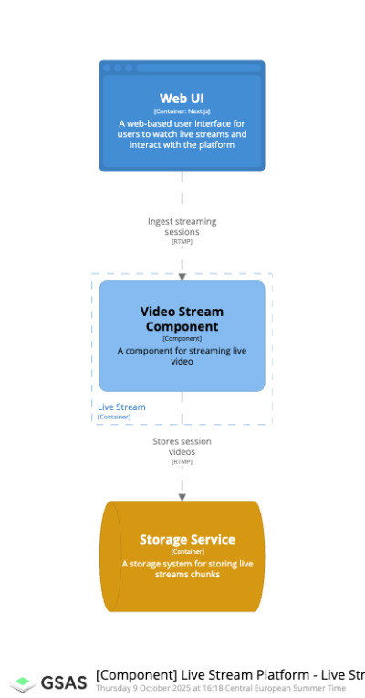
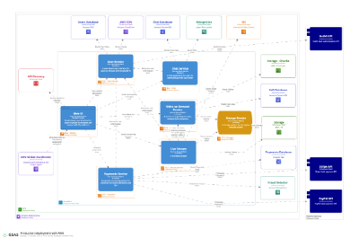

# Live-stream platform

## System design for StageCast

### System Landscape



### Deployment view



## How to run this example

Execute this command to run a Docker container with a structurizr lite image.

### Mac OS / Linux

```bash
docker run --name gsas-structurizr --env=PORT=8080 --volume=$(pwd)/workspace:/usr/local/structurizr -p 8888:8080 -d structurizr/lite:latest
```

### Windows + WSL

```commandline
docker run --name gsas-structurizr --env=PORT=8080 --volume="%cd%\workspace:/usr/local/structurizr" -p 8888:8080 -d structurizr/lite:latest
```

### Windows

```commandline
docker run --name gsas-structurizr --env=PORT=8080 --volume="/c/Users/<YourUser>/workspace:/usr/local/structurizr" -p 8888:8080 -d structurizr/lite:preview
```

## Links

* [Structurizr](http://localhost:8888/)
* [Documentation](http://localhost:8888/workspace/documentation)
* [ADRs](http://localhost:8888/workspace/decisions)
* [Diagrams](http://localhost:8888/workspace/explore)